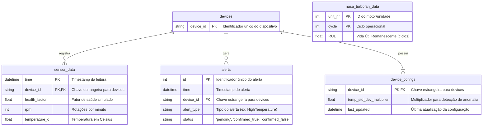
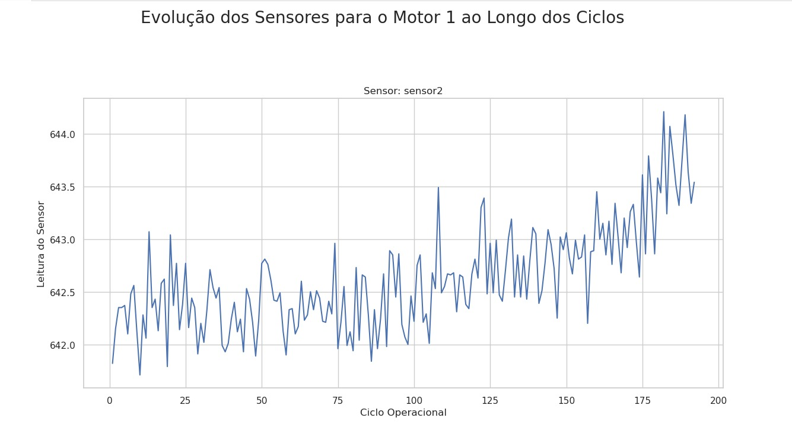
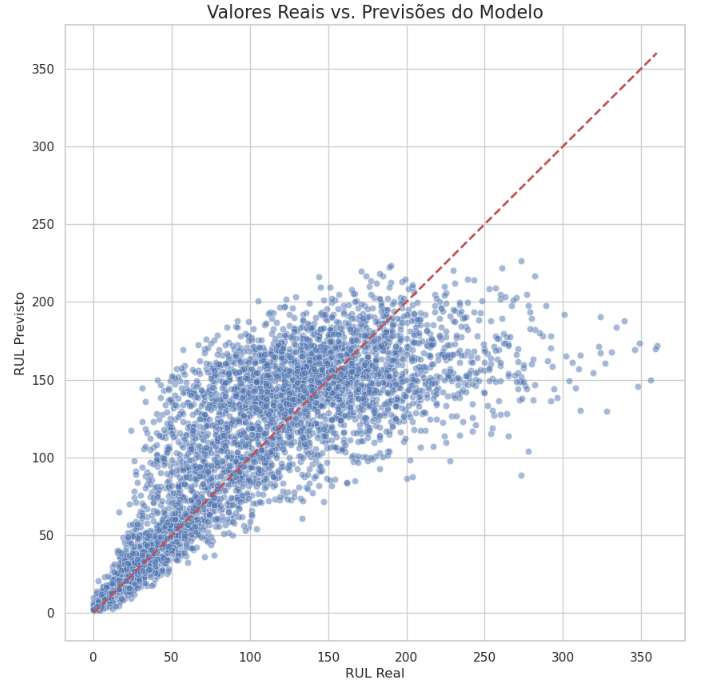

# FIAP - Faculdade de Informática e Administração Paulista

<p align="center">
<a href="https://www.fiap.com.br/"></a>
</p>

<br>

## Desafio 3: Modelagem de Dados e Machine Learning para Manutenção Preditiva

### Grupo: GRUPO 3

**Integrantes:**
* João José Domingues Siva (RM564111)
* Murílo Santana (RM565932)
* William Ferreira (RM566537)
* William Xavier (566449)

**Tutores:**
* Tutor: [Lucas Gomes]

**Coordenadores:**
* Coordenador: [André Godoi]

---
### Tópicos

* [Descrição do projeto](#descrição-do-projeto)
* [Funcionalidades](#funcionalidades)
* [Distribuição da Aplicação](#distribuição-da-aplicação)
* [Pré-requisitos](#pré-requisitos)
* [Como rodar a aplicação](#como-rodar-a-aplicação)
* [Testes Realizados](#testes-realizados)
* [Banco de Dados](#banco-de-dados)
* [Machine Learning](#machine-learning)
* [Vídeo de Apresentação do Projeto](#vídeo-de-apresentação-do-projeto)

---
## Descrição do projeto
O **Timeline-X** é um sistema de Réplicas Digitais Evolutivas (RDE) projetado para a prevenção de falhas em equipamentos de linhas de produção industrial. A solução utiliza o motor de inteligência artificial **Cronos AI** para analisar dados de sensores em tempo real, prever falhas com alta precisão e permitir o ajuste dinâmico dos modelos através de um ciclo de feedback contínuo. A arquitetura híbrida combina processamento centralizado na nuvem com personalização e autonomia local, garantindo privacidade e eficiência.

---
## Funcionalidades
- **Pipeline de Dados em Tempo Real:** Simulação de dados de sensores (`edge-device`) que são enviados para uma fila de mensagens (SQS) e consumidos por uma API central.
- **Persistência de Dados Robusta:** Armazenamento de dados de séries temporais em um banco de dados TimescaleDB (PostgreSQL).
- **Motor de IA Adaptativo:** Detecção de anomalias em múltiplos níveis e um sistema de autoajuste que refina a sensibilidade dos alertas com base no feedback do usuário.
- **API REST Completa:** Endpoints para consultar dados brutos, agregados, alertas e para configurar o motor de IA.
- **Painel Admin Interativo:** Interface em React para visualização e gestão de alertas, permitindo o feedback humano que alimenta o ciclo de aprendizado do sistema.
- **Dashboard de Monitoramento de Logs:** Logs de todos os serviços centralizados e visualizáveis em tempo real com Grafana e Loki.
- **Importador de Dados Históricos:** Capacidade de importar e processar datasets do mundo real (NASA Turbofan) para treinamento de modelos de ML.
- **Ambiente de Ciência de Dados Integrado:** Serviço Jupyter Notebook para análise exploratória de dados e desenvolvimento de modelos.

---
## Distribuição da Aplicação
Toda a aplicação, incluindo os múltiplos serviços de backend, frontend, banco de dados, e a pilha de monitoramento, é orquestrada com Docker e Docker Compose, garantindo um ambiente de desenvolvimento e execução consistente e de fácil distribuição.

---
## Pré-requisitos
Antes de executar o projeto, é necessário ter as seguintes ferramentas instaladas:
* Docker Desktop
* Node.js e npm
* AWS Command Line Interface (CLI)

---
## Como rodar a aplicação
Com os pré-requisitos instalados, o ecossistema completo pode ser iniciado com um único comando no terminal, a partir da pasta raiz do projeto.

```bash
docker-compose up --build
```

---
## Testes Realizados
Após a inicialização completa dos serviços, o funcionamento do sistema pode ser verificado através dos seguintes pontos de acesso:

- **Painel Admin (Frontend):** `http://localhost:5173`
- **Documentação da API:** `http://localhost:8000/docs`
- **Dashboard de Logs (Grafana + Loki):** `http://localhost:3000` (login: `admin`/`admin`)
- **Ambiente de Análise (Jupyter):** A URL de acesso com token é exibida nos logs do contêiner `jupyter-notebook` durante a inicialização.

---
## Banco de Dados

### Modelagem
O banco de dados foi modelado em um esquema relacional para suportar tanto os dados operacionais em tempo real quanto os dados históricos para treinamento de ML. As principais tabelas são: `sensor_data`, `alerts`, `device_configs`, e `nasa_turbofan_data`.

### Diagrama Entidade-Relacionamento (DER)
O diagrama abaixo descreve as entidades e seus relacionamentos.



### Scripts SQL
O script SQL para a criação de todas as tabelas está disponível no arquivo:
[schema.sql](./schema.sql)

---
## Machine Learning

### Análise Exploratória
A primeira etapa consistiu na Análise Exploratória de Dados (EDA) do dataset da NASA. O objetivo foi visualizar o comportamento dos sensores ao longo do tempo para identificar quais deles apresentavam tendências de degradação claras.



### Modelo Preditivo
A tarefa de ML escolhida foi a **regressão** para prever a **Vida Útil Remanescente (RUL)** de um motor.
1.  **Seleção de Features:** Foram removidas colunas com valores constantes ou que não representavam sensores de desgaste.
2.  **Algoritmo:** Foi utilizado o `RandomForestRegressor` da biblioteca Scikit-learn.
3.  **Treinamento:** O modelo foi treinado com 80% dos dados históricos, utilizando as leituras dos sensores como features (`X`) para prever a `RUL` (`y`).

### Resultados
O modelo foi avaliado com os 20% restantes dos dados (conjunto de teste). O gráfico abaixo compara a RUL real com a RUL prevista pelo modelo. A concentração de pontos ao longo da linha diagonal indica um bom desempenho do modelo.

**Métricas de Performance:**
- **RMSE (Raiz do Erro Quadrático Médio):** 41.32
- **R² (Coeficiente de Determinação):** 0.63



---
## Vídeo de Apresentação do Projeto

**[link do yt]**

---